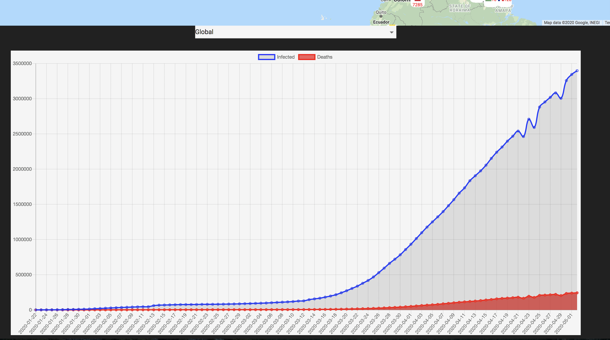
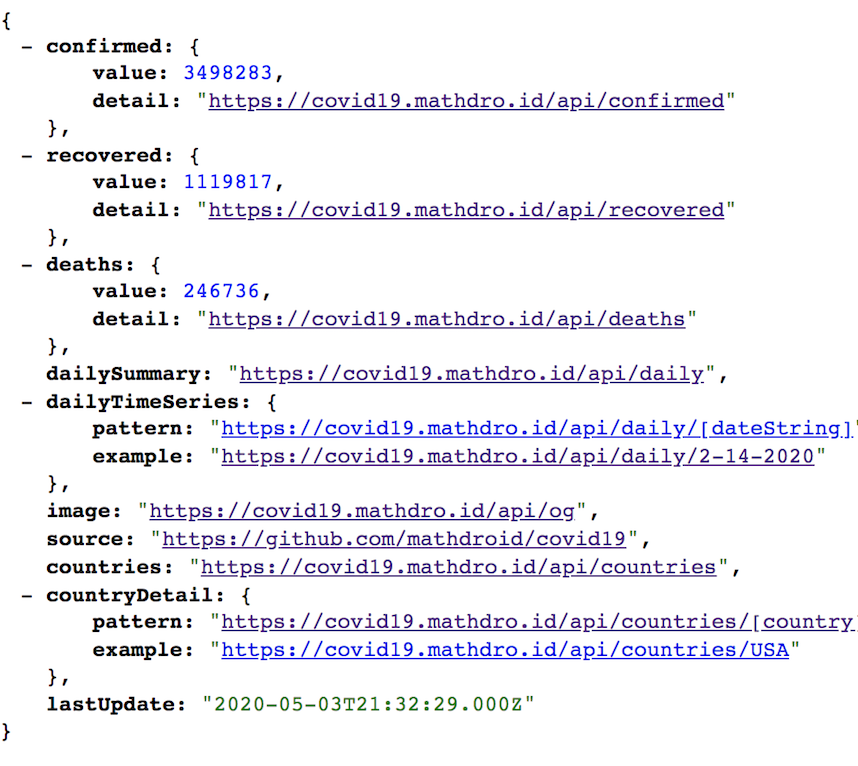
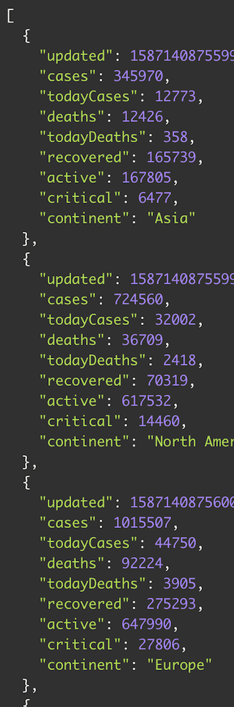

### Covid-19 Data Tracker

This data app tracker shows the numbers and trends of people affected, recovered and decreased due to Covid-19.
[Live-Demo](https://agile-journey-16354.herokuapp.com)

### Screenshots

### Technologies Used

- React -Front end Javascript library
- Material UI - React UI Framework
- Charts.js - HTML5 Charts
- Axios -Promise based Http client
- Google Maps

### Api's Used

[covid19.mathdro.id](https://covid19.mathdro.id/api) -used for data

[Novel-covid-api](https://documenter.getpostman.com/view/11144369/Szf6Z9B3?version=latest) - used to import data to map

